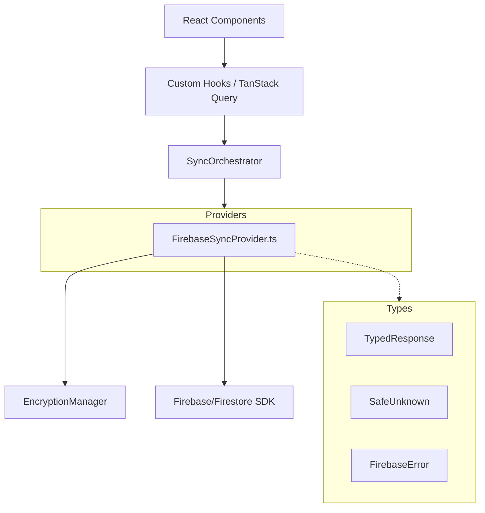

# Typed Firebase Services

**Last Updated:** January 18, 2026
**Architecture Level:** Service Layer (v2.0)

This document describes the type-safe Firebase service architecture implemented for VioletVault v2.0. Following the full TypeScript conversion, all sync operations are natively typed to ensure data integrity across the Dexie and Firestore boundaries.

## 🚀 Overview

The typed Firebase services layer provides comprehensive type safety for data synchronization, chunked uploads, and error handling. This architecture ensures that sensitive budget data is validated and correctly formatted before encryption and cloud storage.

### Core Principles

1. **Strict Boundary Typing**: All operations use `TypedResponse<T>` and `SafeUnknown` to eliminate `any` types at service boundaries.
2. **Native TypeScript**: Services are implemented in 100% strict TypeScript (no "JS wrappers").
3. **Zod-Ready Entities**: Data entities retrieved from Firebase are ready for immediate validation via Zod schemas.
4. **Resilient Communication**: Built-in error categorization and retry logic for high-latency or unstable networks.

## 🏗️ Architecture



## 📋 Key Components

### 1. `FirebaseSyncProvider.ts`

The primary implementation of the `SyncProvider` interface. It handles:

- **Initialization**: Configures Firebase and ensures anonymous authentication.
- **Save (Upload)**: Logic for encrypting and chunking large arrays into 500-item Firestore documents.
- **Load (Download)**: Logic for retrieving, reassembling, and decrypting budget data.
- **Direction Logic**: Deterministic `upload` vs `download` decision based on `lastModified` timestamps.

### 2. Type-Safe Responses (`TypedResponse<T>`)

Every cloud operation returns a structured response:

```typescript
export interface TypedResponse<T> {
  readonly success: boolean;
  readonly data?: T;
  readonly error?: FirebaseError;
  readonly timestamp: number;
}
```

### 3. Error Categorization

Errors are automatically categorized into logical groups to drive UI recovery logic:

- `network`: Timeouts, connectivity issues.
- `encryption`: Decryption failures (often due to wrong password).
- `firebase`: Permission or quota issues.
- `validation`: Data integrity or checksum failures.
- `authentication`: Session or credential issues.

## 🛠️ Usage Example

Example of using the `SyncProvider` within the orchestration layer:

```typescript
const provider = new FirebaseSyncProvider();
await provider.initialize(budgetId, encryptionKey);

const result = await provider.save(localData);

if (result.success) {
  logger.info("Successfully synced to cloud");
} else {
  // logic based on error category
  if (result.error?.category === "encryption") {
    promptForPassword();
  }
}
```

## 📦 Chunking & Manifest Management

To bypass Firestore's 1MB document limit, large budgets are automatically split:

- **Main Document**: Stores budget metadata and small collections.
- **Sub-collection (`chunks`)**: Stores segmented arrays of `envelopes` and `transactions`.
- **Manifest**: Each sync includes a manifest verification of total chunks and checksums.

## 📈 Testing Strategy

The typed services are validated via:

- **Unit Tests**: Verifying categorization logic and chunk segmentation.
- **Integration Tests**: End-to-end sync flows between Dexie and Firestore.
- **Security Tests**: Ensuring data is never uploaded in plain text and individual chunks are correctly encrypted.

---

## 🔗 Related Documentation

- [Data Model Simplification](./DATA_MODEL_SIMPLIFICATION.md)
- [Source Code Directory](./Source-Code-Directory.md)
- [v2.0 Migration Guide](../migration/v2.0-migration-guide.md)
