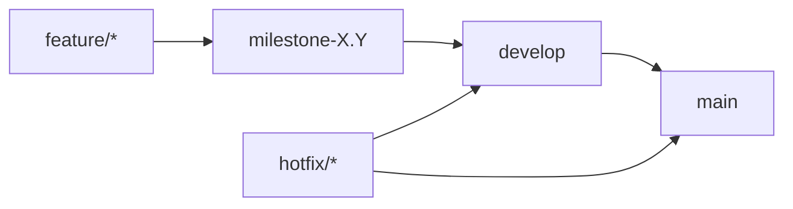

# VioletVault Production Deployment Guide

**Last Updated:** January 18, 2026
**Version:** 2.0.0-beta.1 (v2.0 Architecture)

This document outlines the production-ready development and deployment workflow for VioletVault, established during the v2.0 migration.

## 🌿 Branch Strategy

The project follows a tiered branch strategy to ensure production stability.



### 📋 Branch Rules

1.  **main**: Production-ready code only. No direct commits (except `fix/docs/CI/revert`). All releases happen from here.
2.  **develop**: Integration branch for completed milestones.
3.  **milestone-X.Y**: Intermediate target for new features and enhancements.
4.  **feature/\***: Individual work branches. Must branch from `milestone-X.Y` (or `develop` if no active milestone).

---

## 🛠️ Development Workflow

### 1. Initialize Feature

```bash
git checkout milestone-X.Y
git checkout -b feature/your-feature-name
```

### 2. Verify Changes

Before committing, you **MUST** run the full audit suite:

```bash
npm run format
npm run lint
npm run typecheck
npm run test:run
```

> [!IMPORTANT]
> **Mandatory Coverage**: All new/modified code must have **80%+ test coverage** (`npm run test:coverage`).

### 3. Commit Strategy

We use **Conventional Commits**:

- `feat:` New features
- `fix:` Bug fixes
- `refactor:` Code changes that neither fix a bug nor add a feature
- `style:` Changes that do not affect the meaning of the code
- `perf:` performance improvements

---

## 🚀 Deployment Process

### 1. Build & Preview

Always verify the production build locally before deploying:

```bash
npm run build
npm run preview
```

### 2. Staging Deployment

Staging uses the `staging` mode for configuration:

```bash
npm run deploy:staging
```

### 3. Production Deployment

Production deployment is triggered after merging `develop` to `main`:

```bash
npm run deploy:production
```

---

## 🧪 Deployment Checklist

### Code Quality Quality Gates

- [ ] `npm run audit:full` passes with zero critical warnings.
- [ ] `npm run typecheck:strict` passes.
- [ ] Test coverage exceeds 80% for the feature area.

### Visual & Functional Checks

- [ ] Glassmorphic UI remains consistent (v4 theme).
- [ ] Firebase sync chunking logic verified for large budgets.
- [ ] Encryption/Decryption verified with rotating keys.
- [ ] Service worker / PWA status is "Ready for Offline".

---

## 🏗️ Environment Configuration

| Variable               | Development   | Staging   | Production   |
| :--------------------- | :------------ | :-------- | :----------- |
| `VITE_APP_ENV`         | `development` | `staging` | `production` |
| `VITE_DEBUG_MODE`      | `true`        | `false`   | `false`      |
| `VITE_VERBOSE_LOGGING` | `true`        | `true`    | `false`      |

---

## 🆘 Critical Support (Hotfixes)

If a bug is found on `main`:

1.  Create a `hotfix/*` branch from `main`.
2.  Apply the minimal fix.
3.  Run `npm run test:ci`.
4.  Merge to `main` and immediately merge to `develop` to prevent regression.
5.  Create a GH issue labeled `bug` if the fix is delayed.
