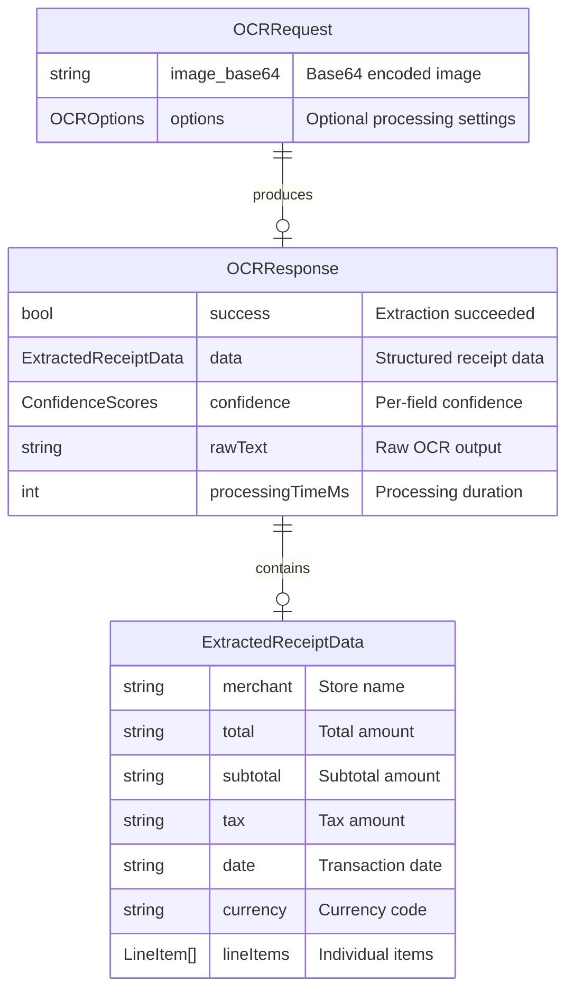

# Python OCR & AI Extraction Engine

## Overview

Implement a high-performance, privacy-focused receipt ingestion engine in Python. This service extracts structured financial data (merchant, amount, date) from receipt images without persisting raw images, ensuring E2EE architectural compliance.

**Key Change:** Migrate OCR processing from client-side (tesseract.js in React) to server-side (PaddleOCR + Tesseract in Python), reducing frontend bundle size while improving accuracy from ~82% to 91%+.

## Problem Statement / Motivation

**Current State:**

- OCR runs client-side using tesseract.js (~82% accuracy on receipts)
- Heavy JavaScript bundle (~2MB for tesseract.js + WASM)
- Limited preprocessing capabilities in browser
- Inconsistent results across devices/browsers

**Desired State:**

- Server-side OCR with PaddleOCR (~91% accuracy on structured documents)
- Lightweight frontend (API call replaces tesseract.js)
- Robust OpenCV preprocessing pipeline
- Privacy-first: zero disk I/O, transient processing only

**Why Now:**

- SentinelShare module expansion requires reliable receipt data extraction
- User feedback on OCR accuracy issues with faded/blurry receipts
- Bundle size optimization initiative for faster app loads

## Proposed Solution

### Architecture

```
┌─────────────────┐     ┌──────────────────────────────────────────────┐
│   Frontend      │     │              Python Backend                   │
│                 │     │                                              │
│ ReceiptScanner  │────▶│ POST /api/receipts/extract                   │
│ Component       │     │      │                                       │
│                 │     │      ▼                                       │
│ ocrProcessor.ts │◀────│ ImagePreprocessor (OpenCV)                   │
│ (API call)      │     │      │                                       │
│                 │     │      ▼                                       │
└─────────────────┘     │ ReceiptExtractor                             │
                        │   ├── PaddleOCR (primary, 91% accuracy)      │
                        │   └── Tesseract (fallback, lighter weight)   │
                        │      │                                       │
                        │      ▼                                       │
                        │ ReceiptParser (regex/NLP extraction)         │
                        │      │                                       │
                        │      ▼                                       │
                        │ JSON Response + Memory Cleanup               │
                        └──────────────────────────────────────────────┘
```

### API Contract

**Endpoint:** `POST /api/receipts/extract`

**Request Format:** JSON with base64-encoded image (recommended for E2EE compliance - avoids SpooledTemporaryFile disk writes that occur with multipart at >1MB)

```json
{
  "image_base64": "data:image/jpeg;base64,/9j/4AAQSkZJRg...",
  "options": {
    "language": "en",
    "preprocessing": true
  }
}
```

**Response Format:**

```json
{
  "success": true,
  "data": {
    "merchant": "WALMART",
    "total": "29.99",
    "subtotal": "27.50",
    "tax": "2.49",
    "date": "2026-01-15",
    "currency": "USD",
    "lineItems": [
      { "description": "MILK 2%", "price": "4.99" },
      { "description": "BREAD", "price": "3.50" }
    ]
  },
  "confidence": {
    "merchant": "high",
    "total": "high",
    "date": "medium",
    "overall": 0.87
  },
  "rawText": "WALMART\n123 MAIN ST...",
  "processingTimeMs": 1250
}
```

**Error Response:**

```json
{
  "success": false,
  "error": {
    "code": "EXTRACTION_FAILED",
    "message": "Could not extract data from image"
  },
  "rawText": "",
  "processingTimeMs": 500
}
```

## Technical Considerations

### Privacy & Security (Critical)

| Requirement          | Implementation                                                                                                                                  |
| -------------------- | ----------------------------------------------------------------------------------------------------------------------------------------------- |
| **Zero Disk I/O**    | Use `io.BytesIO` exclusively; never `tempfile`. Validate OpenCV/PaddleOCR don't create temp files.                                              |
| **Memory Cleanup**   | Explicit `del` + `gc.collect()` after processing. Use `try/finally` for guaranteed cleanup.                                                     |
| **PII Scrubbing**    | Extend existing `scrub_pii()` in [api/main.py:16-62](api/main.py#L16-L62) for Sentry errors. Never log image bytes or extracted financial data. |
| **Input Validation** | Validate magic bytes (not just Content-Type). Enforce 5MB limit. Reject non-image files.                                                        |
| **Rate Limiting**    | Add rate limiting to prevent DoS. Consider per-user limits.                                                                                     |

### Performance

| Target                    | Strategy                                                                                                                    |
| ------------------------- | --------------------------------------------------------------------------------------------------------------------------- |
| **<1.5s response (720p)** | Resize images to max 960px before OCR. Use PaddleOCR with `use_doc_orientation_classify=False` for speed.                   |
| **Cold start mitigation** | Add OCR engine warm-up to existing `/api/warm` endpoint. Pre-load models at startup.                                        |
| **Memory leaks**          | PaddleOCR has documented memory leaks. Implement worker recycling (restart after N requests) or use short-lived containers. |
| **Concurrent requests**   | Limit to 2-4 concurrent OCR operations to prevent memory exhaustion. Queue excess requests.                                 |

### OCR Engine Strategy

**Primary: PaddleOCR**

- 91%+ accuracy on structured documents (vs Tesseract's 82%)
- Better handling of varied layouts, tables, rotated text
- Memory leak requires mitigation (worker recycling)

**Fallback: Tesseract (pytesseract)**

- Triggers when: PaddleOCR throws exception OR confidence < 40% OR returns empty text
- Lighter weight, stable memory usage
- Use `--oem 1 --psm 6` for receipt optimization

**Result Merging:**

- If both engines run, prefer result with higher overall confidence
- For partial results, merge fields from both (PaddleOCR merchant + Tesseract total if higher confidence)

### Preprocessing Pipeline

```python
# Order matters for accuracy
1. Resize (max 960px, preserve aspect ratio)
2. Convert to grayscale
3. Denoise (cv2.fastNlMeansDenoising)
4. Enhance contrast (CLAHE)
5. Deskew (cv2.minAreaRect angle correction)
6. Adaptive threshold (cv2.adaptiveThreshold, Gaussian, blockSize=11)
```

## Acceptance Criteria

### Functional Requirements

- [ ] POST /api/receipts/extract endpoint accepts base64 JSON and returns structured data
- [ ] Successfully extracts merchant, total, date from 90%+ of standard grocery/gas receipts
- [ ] Fallback to Tesseract when PaddleOCR fails or returns low confidence
- [ ] Returns partial data with confidence indicators when full extraction impossible
- [ ] Frontend ocrProcessor.ts calls backend API instead of tesseract.js

### Non-Functional Requirements

- [ ] Response time < 1.5s for 720p images (measured at p95)
- [ ] Zero disk I/O for image data (verified by integration test)
- [ ] No PII in Sentry errors or logs
- [ ] Memory usage < 500MB per request
- [ ] Graceful handling of 5+ concurrent requests (queue, don't crash)

### Quality Gates

- [ ] Unit tests with mocked OCR engines (fast CI)
- [ ] Integration tests with sample receipt images
- [ ] Accuracy benchmark against 50+ sample receipts
- [ ] Memory leak regression test (process 100 images, verify stable memory)
- [ ] Security review of input validation and error handling

## Success Metrics

| Metric                   | Target    | Measurement                                        |
| ------------------------ | --------- | -------------------------------------------------- |
| **Extraction Accuracy**  | 90%+      | Per-field correctness against ground truth dataset |
| **Response Time (p95)**  | < 1.5s    | Server-side timing logs                            |
| **Frontend Bundle Size** | -2MB      | Remove tesseract.js dependency                     |
| **Error Rate**           | < 5%      | Requests returning `success: false`                |
| **Memory Stability**     | No growth | Memory usage stable after 100 requests             |

## Dependencies & Risks

### Dependencies

| Dependency               | Status | Notes                                                |
| ------------------------ | ------ | ---------------------------------------------------- |
| PaddleOCR                | New    | `pip install paddlepaddle paddleocr` (~150MB)        |
| pytesseract              | New    | Requires Tesseract binary installed on server        |
| OpenCV                   | New    | `pip install opencv-python-headless`                 |
| Existing sentinel router | Ready  | [api/sentinel/receipts.py](api/sentinel/receipts.py) |

### Risks

| Risk                                   | Likelihood | Impact | Mitigation                                              |
| -------------------------------------- | ---------- | ------ | ------------------------------------------------------- |
| PaddleOCR memory leaks in production   | High       | Medium | Worker recycling, memory monitoring, container restarts |
| Cold start exceeds 1.5s target         | Medium     | Low    | Warm-up endpoint, pre-load models                       |
| Tesseract binary missing in deployment | Medium     | High   | Add to Dockerfile, verify in CI                         |
| OCR accuracy below 90% in real-world   | Medium     | Medium | Iterative preprocessing tuning, user feedback loop      |
| Large images cause OOM                 | Low        | High   | Enforce 5MB limit, resize before processing             |

## Implementation Plan

### Phase 1: Core OCR Engine

**Files:**

```
api/sentinel/
├── ocr_engine.py      [NEW] ReceiptExtractor class
├── preprocessing.py   [NEW] ImagePreprocessor utilities
├── models.py          [NEW] Pydantic models for OCR
└── test_ocr.py        [NEW] pytest unit tests
```

**ocr_engine.py** - Core extraction logic:

```python
class ReceiptExtractor:
    """Privacy-preserving OCR with PaddleOCR + Tesseract fallback."""

    def __init__(self):
        self.paddle_ocr = PaddleOCR(
            use_doc_orientation_classify=False,
            use_doc_unwarping=False,
            lang='en'
        )

    def extract(self, image_bytes: bytes) -> ExtractionResult:
        """Main extraction - handles cleanup, validation, fallback."""
        try:
            # Preprocess
            processed = self.preprocessor.preprocess(image_bytes)

            # Primary OCR
            result = self._run_paddleocr(processed)

            # Fallback if needed
            if result.confidence < 0.4 or not result.text:
                tesseract_result = self._run_tesseract(processed)
                result = self._merge_results(result, tesseract_result)

            # Parse structured data
            return self.parser.parse(result.text)

        finally:
            # Critical: explicit cleanup
            del image_bytes
            if 'processed' in locals():
                del processed
            gc.collect()
```

**preprocessing.py** - OpenCV pipeline:

```python
class ImagePreprocessor:
    """Memory-efficient image preprocessing for OCR."""

    @staticmethod
    def preprocess(image_bytes: bytes) -> np.ndarray:
        # Load from bytes (no disk)
        nparr = np.frombuffer(image_bytes, np.uint8)
        img = cv2.imdecode(nparr, cv2.IMREAD_COLOR)
        del nparr

        # Resize if needed
        img = ImagePreprocessor._resize(img, max_side=960)

        # Grayscale
        gray = cv2.cvtColor(img, cv2.COLOR_BGR2GRAY)
        del img

        # Denoise
        denoised = cv2.fastNlMeansDenoising(gray, None, 10, 7, 21)
        del gray

        # CLAHE contrast enhancement
        clahe = cv2.createCLAHE(clipLimit=2.0, tileGridSize=(8, 8))
        enhanced = clahe.apply(denoised)
        del denoised

        # Adaptive threshold
        binary = cv2.adaptiveThreshold(
            enhanced, 255,
            cv2.ADAPTIVE_THRESH_GAUSSIAN_C,
            cv2.THRESH_BINARY, 11, 2
        )
        del enhanced

        return binary
```

### Phase 2: API Endpoint

**Modify** [api/sentinel/receipts.py](api/sentinel/receipts.py):

```python
class OCRRequest(BaseModel):
    image_base64: str
    options: OCROptions | None = None

    @field_validator("image_base64")
    @classmethod
    def validate_size(cls, v: str) -> str:
        estimated_size = len(v) * 3 // 4
        if estimated_size > 5 * 1024 * 1024:  # 5MB
            raise ValueError("Image too large (max 5MB)")
        return v

class OCRResponse(BaseModel):
    success: bool
    data: ExtractedReceiptData | None = None
    confidence: ConfidenceScores
    rawText: str = ""
    processingTimeMs: int
    error: ErrorDetail | None = None

@router.post("/extract", response_model=OCRResponse)
async def extract_receipt(request: OCRRequest):
    """Extract structured data from receipt image."""
    start_time = time.time()

    try:
        # Decode and validate
        image_bytes = decode_base64_image(request.image_base64)
        validate_image_magic_bytes(image_bytes)

        # Extract
        result = ocr_service.extract(image_bytes)

        return OCRResponse(
            success=True,
            data=result.data,
            confidence=result.confidence,
            rawText=result.raw_text,
            processingTimeMs=int((time.time() - start_time) * 1000)
        )

    except ExtractionError as e:
        return OCRResponse(
            success=False,
            error=ErrorDetail(code="EXTRACTION_FAILED", message=str(e)),
            processingTimeMs=int((time.time() - start_time) * 1000)
        )
    finally:
        if 'image_bytes' in locals():
            del image_bytes
        gc.collect()
```

### Phase 3: Service Mesh Integration

**Add OCR service to discovery** - Modify [src/utils/core/api/discovery.ts](src/utils/core/api/discovery.ts):

```typescript
export type ServiceName = "go-backend" | "py-analytics" | "py-ocr";

export const resolveServiceUrl = (service: ServiceName): string => {
  const env = getEnv();

  switch (service) {
    case "go-backend":
      if (env.GO_API_URL) return env.GO_API_URL;
      return env.PROD ? "/api/bug-report" : "http://localhost:3001/api";

    case "py-analytics":
      if (env.PY_API_URL) return env.PY_API_URL;
      return env.PROD ? "/api/analytics" : "http://localhost:8000/api";

    case "py-ocr":
      // OCR service runs on same Python backend as analytics
      if (env.PY_API_URL) return env.PY_API_URL;
      return env.PROD ? "/api" : "http://localhost:8000/api";

    default:
      throw new Error(`Unknown service: ${service}`);
  }
};
```

**Add pre-configured OCR client** - Modify [src/utils/core/api/client.ts](src/utils/core/api/client.ts):

```typescript
// Add to bottom of file
export const ocrClient = new APIClient("py-ocr");
```

**Modify** `src/utils/core/common/ocrProcessor.ts`:

```typescript
// Remove tesseract.js import and worker creation
import { ocrClient } from "@/utils/core/api/client";

export interface OCRProcessorOptions {
  language?: string;
  preprocessing?: boolean;
}

export async function processReceiptImage(
  imageData: string | Blob,
  options: OCRProcessorOptions = {}
): Promise<ExtendedReceiptData> {
  const base64 = imageData instanceof Blob ? await blobToBase64(imageData) : imageData;

  // Use service mesh client with circuit breaker, retry, discovery
  const result = await ocrClient.post<OCRResponse>(
    "/receipts/extract",
    {
      image_base64: base64,
      options: {
        language: options.language || "en",
        preprocessing: options.preprocessing !== false,
      },
    },
    {
      maxAttempts: 2, // Retry once on failure
      retryOptions: {
        shouldRetry: (error) => {
          // Don't retry client errors (400-499)
          if (error instanceof Error && error.message.includes("400")) {
            return false;
          }
          return true; // Retry server errors and network issues
        },
      },
    }
  );

  if (!result.success) {
    throw new OCRError(result.error?.message || "Extraction failed");
  }

  // Map to existing ExtendedReceiptData interface for backward compatibility
  return mapToExtendedReceiptData(result.data, result.confidence);
}
```

### Phase 4: Comprehensive Testing (80%+ Coverage)

#### Python Backend Tests

**Test Structure:**

```
api/sentinel/__tests__/
├── test_ocr_engine.py         # Core OCR extraction logic (80%+ coverage)
├── test_preprocessing.py      # Image preprocessing pipeline (80%+ coverage)
├── test_parser.py             # Receipt data parsing (80%+ coverage)
├── test_extract_endpoint.py   # API endpoint integration (80%+ coverage)
└── fixtures/
    ├── sample_grocery.jpg     # Standard grocery receipt
    ├── sample_gas.jpg          # Gas station receipt
    ├── sample_blurry.jpg       # Low quality test
    └── sample_rotated.jpg      # Skewed image test
```

**`test_ocr_engine.py`** - Core extraction (Target: 85%+ coverage):

```python
import gc
import pytest
from unittest.mock import patch, MagicMock
from api.sentinel.ocr_engine import ReceiptExtractor, ExtractionError
from api.sentinel.models import ExtractionResult, ConfidenceScores

# Fixtures
@pytest.fixture
def sample_image_bytes():
    """Load a 1x1 pixel test image."""
    return b'\xff\xd8\xff\xe0\x00\x10JFIF...'  # Minimal valid JPEG

@pytest.fixture
def mock_paddleocr():
    with patch('api.sentinel.ocr_engine.PaddleOCR') as mock:
        mock.return_value.ocr.return_value = [[
            ([[0,0], [100,0], [100,20], [0,20]], ("WALMART", 0.95)),
            ([[0,30], [100,30], [100,50], [0,50]], ("123 MAIN ST", 0.88)),
            ([[0,60], [100,60], [100,80], [0,80]], ("TOTAL $29.99", 0.92)),
            ([[0,90], [100,90], [100,110], [0,110]], ("01/15/2026", 0.90)),
        ]]
        yield mock

# Happy Path Tests
def test_extraction_happy_path(mock_paddleocr, sample_image_bytes):
    """Test successful extraction with high confidence."""
    extractor = ReceiptExtractor()
    result = extractor.extract(sample_image_bytes)

    assert result.data.merchant == "WALMART"
    assert result.data.total == "29.99"
    assert result.data.date == "2026-01-15"
    assert result.confidence.overall > 0.85
    assert result.confidence.merchant == "high"
    assert result.confidence.total == "high"

def test_memory_cleanup_after_extraction(mock_paddleocr, sample_image_bytes):
    """Verify explicit memory cleanup occurs."""
    extractor = ReceiptExtractor()
    initial_ref_count = len(gc.get_objects())

    result = extractor.extract(sample_image_bytes)

    # Force garbage collection
    gc.collect()
    final_ref_count = len(gc.get_objects())

    # Object count should not grow significantly
    assert final_ref_count - initial_ref_count < 100

# Fallback Tests
def test_fallback_to_tesseract_on_exception(sample_image_bytes):
    """Test Tesseract fallback when PaddleOCR raises exception."""
    with patch('api.sentinel.ocr_engine.PaddleOCR') as paddle_mock:
        paddle_mock.return_value.ocr.side_effect = RuntimeError("PaddleOCR crashed")

        with patch('api.sentinel.ocr_engine.pytesseract') as tess_mock:
            tess_mock.image_to_string.return_value = "WALMART\n123 MAIN ST\nTOTAL $29.99\n01/15/2026"

            extractor = ReceiptExtractor()
            result = extractor.extract(sample_image_bytes)

            assert result.data.merchant == "WALMART"
            assert result.data.total == "29.99"
            tess_mock.image_to_string.assert_called_once()

def test_fallback_to_tesseract_on_low_confidence(sample_image_bytes):
    """Test Tesseract fallback when PaddleOCR confidence < 40%."""
    with patch('api.sentinel.ocr_engine.PaddleOCR') as paddle_mock:
        paddle_mock.return_value.ocr.return_value = [[
            ([[0,0], [50,0], [50,20], [0,20]], ("UNCLEAR", 0.25)),
            ([[0,30], [50,30], [50,50], [0,50]], ("TEXT", 0.30)),
        ]]

        with patch('api.sentinel.ocr_engine.pytesseract') as tess_mock:
            tess_mock.image_to_string.return_value = "WALMART\nTOTAL $29.99"

            extractor = ReceiptExtractor()
            result = extractor.extract(sample_image_bytes)

            # Should prefer Tesseract result due to low PaddleOCR confidence
            tess_mock.image_to_string.assert_called_once()

def test_fallback_to_tesseract_on_empty_result(sample_image_bytes):
    """Test Tesseract fallback when PaddleOCR returns empty."""
    with patch('api.sentinel.ocr_engine.PaddleOCR') as paddle_mock:
        paddle_mock.return_value.ocr.return_value = [[]]

        with patch('api.sentinel.ocr_engine.pytesseract') as tess_mock:
            tess_mock.image_to_string.return_value = "WALMART\nTOTAL $29.99"

            extractor = ReceiptExtractor()
            result = extractor.extract(sample_image_bytes)

            assert result.data.merchant == "WALMART"
            tess_mock.image_to_string.assert_called_once()

# Error Handling Tests
def test_extraction_fails_both_engines(sample_image_bytes):
    """Test behavior when both OCR engines fail."""
    with patch('api.sentinel.ocr_engine.PaddleOCR') as paddle_mock:
        paddle_mock.return_value.ocr.side_effect = RuntimeError("PaddleOCR failed")

        with patch('api.sentinel.ocr_engine.pytesseract') as tess_mock:
            tess_mock.image_to_string.side_effect = RuntimeError("Tesseract failed")

            extractor = ReceiptExtractor()

            with pytest.raises(ExtractionError) as exc_info:
                extractor.extract(sample_image_bytes)

            assert "Both OCR engines failed" in str(exc_info.value)

def test_invalid_image_bytes():
    """Test handling of corrupted image data."""
    extractor = ReceiptExtractor()
    invalid_bytes = b"not an image"

    with pytest.raises(ExtractionError) as exc_info:
        extractor.extract(invalid_bytes)

    assert "Invalid image" in str(exc_info.value)

def test_extraction_with_timeout(sample_image_bytes):
    """Test timeout handling for long-running OCR."""
    with patch('api.sentinel.ocr_engine.PaddleOCR') as paddle_mock:
        # Simulate slow OCR
        import time
        def slow_ocr(*args, **kwargs):
            time.sleep(5)
            return [[]]

        paddle_mock.return_value.ocr.side_effect = slow_ocr

        extractor = ReceiptExtractor(timeout=1)  # 1 second timeout

        with pytest.raises(ExtractionError) as exc_info:
            extractor.extract(sample_image_bytes)

        assert "timeout" in str(exc_info.value).lower()

# Privacy Tests
def test_zero_disk_io(tmp_path, monkeypatch, sample_image_bytes):
    """Verify no temp files created during processing."""
    # Monitor temp directory
    monkeypatch.setenv("TMPDIR", str(tmp_path))
    monkeypatch.setenv("TEMP", str(tmp_path))
    monkeypatch.setenv("TMP", str(tmp_path))

    original_files = set(tmp_path.glob("**/*"))

    extractor = ReceiptExtractor()
    with patch('api.sentinel.ocr_engine.PaddleOCR'):
        with patch('api.sentinel.ocr_engine.pytesseract'):
            try:
                extractor.extract(sample_image_bytes)
            except:
                pass  # Ignore extraction errors, just check disk I/O

    new_files = set(tmp_path.glob("**/*")) - original_files
    assert len(new_files) == 0, f"Unexpected temp files created: {new_files}"

def test_image_bytes_not_in_memory_after_extraction(mock_paddleocr, sample_image_bytes):
    """Verify image bytes are deleted after extraction."""
    extractor = ReceiptExtractor()
    result = extractor.extract(sample_image_bytes)

    # Check that image_bytes variable is not in extractor's scope
    assert 'image_bytes' not in extractor.__dict__

    # Verify gc.collect() was called
    gc.collect()  # Should not cause issues
```

**`test_preprocessing.py`** - Image preprocessing (Target: 85%+ coverage):

```python
import cv2
import numpy as np
import pytest
from api.sentinel.preprocessing import ImagePreprocessor

@pytest.fixture
def color_image():
    """Create a 100x100 color test image."""
    return np.random.randint(0, 255, (100, 100, 3), dtype=np.uint8)

@pytest.fixture
def grayscale_image():
    """Create a 100x100 grayscale test image."""
    return np.random.randint(0, 255, (100, 100), dtype=np.uint8)

# Happy Path
def test_preprocess_full_pipeline(color_image):
    """Test complete preprocessing pipeline."""
    preprocessor = ImagePreprocessor()
    result = preprocessor.preprocess(color_image)

    assert result.shape == (100, 100)  # Grayscale output
    assert result.dtype == np.uint8
    assert np.min(result) >= 0 and np.max(result) <= 255

def test_preprocess_from_bytes():
    """Test preprocessing from raw image bytes."""
    # Create minimal JPEG bytes
    img = np.zeros((50, 50, 3), dtype=np.uint8)
    success, encoded = cv2.imencode('.jpg', img)
    image_bytes = encoded.tobytes()

    preprocessor = ImagePreprocessor()
    result = preprocessor.preprocess_from_bytes(image_bytes)

    assert result is not None
    assert len(result.shape) == 2  # Grayscale

# Individual Step Tests
def test_to_grayscale_from_color(color_image):
    """Test grayscale conversion."""
    result = ImagePreprocessor.to_grayscale(color_image)
    assert len(result.shape) == 2
    assert result.shape == (100, 100)

def test_to_grayscale_already_gray(grayscale_image):
    """Test grayscale conversion on already gray image."""
    result = ImagePreprocessor.to_grayscale(grayscale_image)
    assert np.array_equal(result, grayscale_image)

def test_resize_large_image():
    """Test resizing of oversized images."""
    large_image = np.random.randint(0, 255, (2000, 3000, 3), dtype=np.uint8)

    result = ImagePreprocessor.resize_if_needed(large_image, max_width=1000, max_height=1000)

    assert result.shape[0] <= 1000
    assert result.shape[1] <= 1000

def test_resize_small_image_unchanged():
    """Test that small images are not upscaled."""
    small_image = np.random.randint(0, 255, (200, 300, 3), dtype=np.uint8)

    result = ImagePreprocessor.resize_if_needed(small_image, max_width=1000, max_height=1000)

    assert result.shape == small_image.shape

def test_denoise(grayscale_image):
    """Test noise removal."""
    result = ImagePreprocessor.denoise(grayscale_image)
    assert result.shape == grayscale_image.shape

def test_enhance_contrast(grayscale_image):
    """Test CLAHE contrast enhancement."""
    result = ImagePreprocessor.enhance_contrast(grayscale_image)
    assert result.shape == grayscale_image.shape

def test_adaptive_threshold(grayscale_image):
    """Test adaptive thresholding."""
    result = ImagePreprocessor.adaptive_threshold(grayscale_image)
    assert result.shape == grayscale_image.shape
    assert set(np.unique(result)).issubset({0, 255})  # Binary output

def test_deskew_rotated_image():
    """Test deskewing of rotated images."""
    # Create a skewed image with text-like pattern
    img = np.zeros((100, 100), dtype=np.uint8)
    cv2.rectangle(img, (10, 10), (90, 30), 255, -1)  # Horizontal bar

    # Rotate it
    M = cv2.getRotationMatrix2D((50, 50), 15, 1.0)
    rotated = cv2.warpAffine(img, M, (100, 100))

    result = ImagePreprocessor.deskew(rotated)

    # Result should be straightened (hard to verify exactly, just check it runs)
    assert result.shape == rotated.shape

def test_deskew_already_straight_image():
    """Test deskewing on already straight image."""
    straight_img = np.zeros((100, 100), dtype=np.uint8)
    cv2.rectangle(straight_img, (10, 40), (90, 60), 255, -1)

    result = ImagePreprocessor.deskew(straight_img)

    # Should be nearly unchanged
    assert result.shape == straight_img.shape

# Error Handling
def test_preprocess_invalid_bytes():
    """Test handling of invalid image bytes."""
    preprocessor = ImagePreprocessor()
    invalid_bytes = b"not an image"

    with pytest.raises(Exception):
        preprocessor.preprocess_from_bytes(invalid_bytes)

def test_preprocess_empty_image():
    """Test handling of empty image."""
    empty = np.array([], dtype=np.uint8)
    preprocessor = ImagePreprocessor()

    with pytest.raises(Exception):
        preprocessor.preprocess(empty)

# Memory Efficiency
def test_memory_cleanup_in_pipeline(color_image):
    """Verify intermediate arrays are deleted."""
    import gc

    preprocessor = ImagePreprocessor()
    initial_count = len(gc.get_objects())

    result = preprocessor.preprocess(color_image)

    gc.collect()
    final_count = len(gc.get_objects())

    # Object growth should be minimal
    assert final_count - initial_count < 50
```

**`test_parser.py`** - Receipt parsing (Target: 85%+ coverage):

```python
import pytest
from decimal import Decimal
from datetime import datetime
from api.sentinel.parser import ReceiptParser, ReceiptData

@pytest.fixture
def parser():
    return ReceiptParser()

# Merchant Extraction
def test_extract_merchant_from_first_line(parser):
    text = """WALMART
    123 MAIN ST
    ANYTOWN, CA 90210
    TOTAL $29.99"""

    result = parser.parse(text)
    assert result.merchant_name == "WALMART"

def test_extract_merchant_skips_address_lines(parser):
    text = """SAFEWAY STORE #1234
    123 OAK AVE
    CITY, STATE 12345"""

    result = parser.parse(text)
    assert result.merchant_name == "SAFEWAY STORE #1234"
    assert "12345" not in result.merchant_name  # ZIP code not included

# Total Extraction
def test_extract_total_with_dollar_sign(parser):
    text = "TOTAL $29.99"
    result = parser.parse(text)
    assert result.total == Decimal("29.99")

def test_extract_total_without_dollar_sign(parser):
    text = "TOTAL 45.50"
    result = parser.parse(text)
    assert result.total == Decimal("45.50")

def test_extract_total_with_comma(parser):
    text = "TOTAL $1,234.56"
    result = parser.parse(text)
    assert result.total == Decimal("1234.56")

def test_extract_grand_total(parser):
    text = """SUBTOTAL $50.00
    TAX $4.50
    GRAND TOTAL $54.50"""

    result = parser.parse(text)
    assert result.total == Decimal("54.50")

# Date Extraction
def test_extract_date_mmddyyyy(parser):
    text = "01/15/2026\nTOTAL $10.00"
    result = parser.parse(text)
    assert result.date == datetime(2026, 1, 15)

def test_extract_date_yyyymmdd(parser):
    text = "2026-01-15\nTOTAL $10.00"
    result = parser.parse(text)
    assert result.date == datetime(2026, 1, 15)

def test_extract_date_european_format(parser):
    text = "15.01.2026\nTOTAL $10.00"
    result = parser.parse(text)
    assert result.date == datetime(2026, 1, 15)

def test_extract_date_text_format(parser):
    text = "January 15, 2026\nTOTAL $10.00"
    result = parser.parse(text)
    assert result.date == datetime(2026, 1, 15)

# Tax and Subtotal
def test_extract_tax(parser):
    text = """SUBTOTAL $50.00
    TAX $4.50
    TOTAL $54.50"""

    result = parser.parse(text)
    assert result.tax == Decimal("4.50")

def test_extract_subtotal(parser):
    text = """SUBTOTAL $50.00
    TAX $4.50
    TOTAL $54.50"""

    result = parser.parse(text)
    assert result.subtotal == Decimal("50.00")

# Currency Detection
def test_detect_usd_currency(parser):
    text = "TOTAL $29.99"
    result = parser.parse(text)
    assert result.currency == "USD"

def test_detect_eur_currency(parser):
    text = "TOTAL 29.99 EUR"
    result = parser.parse(text)
    assert result.currency == "EUR"

def test_detect_gbp_currency(parser):
    text = "TOTAL £29.99"
    result = parser.parse(text)
    assert result.currency == "GBP"

def test_default_currency_when_not_found(parser):
    text = "TOTAL 29.99"
    result = parser.parse(text)
    assert result.currency == "USD"  # Default

# Line Items
def test_extract_line_items(parser):
    text = """MILK 2%     $4.99
    BREAD       $3.50
    EGGS        $5.99
    SUBTOTAL   $14.48
    TAX         $1.30
    TOTAL      $15.78"""

    result = parser.parse(text)

    assert len(result.line_items) == 3
    assert result.line_items[0]["description"] == "MILK 2%"
    assert result.line_items[0]["price"] == Decimal("4.99")
    assert result.line_items[1]["description"] == "BREAD"
    assert result.line_items[1]["price"] == Decimal("3.50")

def test_line_items_exclude_totals(parser):
    text = """ITEM A      $5.00
    SUBTOTAL    $5.00
    TOTAL       $5.00"""

    result = parser.parse(text)

    # Should only extract "ITEM A", not SUBTOTAL or TOTAL
    assert len(result.line_items) == 1
    assert result.line_items[0]["description"] == "ITEM A"

# Edge Cases
def test_parse_empty_text(parser):
    result = parser.parse("")
    assert result.merchant_name is None
    assert result.total is None
    assert result.date is None

def test_parse_text_with_no_extractable_data(parser):
    text = "Lorem ipsum dolor sit amet"
    result = parser.parse(text)
    assert result.merchant_name is not None  # Will extract first line
    assert result.total is None
    assert result.date is None

def test_parse_partial_data(parser):
    text = """WALMART
    TOTAL $29.99"""
    # Missing date

    result = parser.parse(text)
    assert result.merchant_name == "WALMART"
    assert result.total == Decimal("29.99")
    assert result.date is None  # Not found

def test_parse_real_world_receipt(parser):
    """Test with realistic receipt text."""
    text = """WALMART SUPERCENTER
    123 MAIN STREET
    ANYTOWN CA 90210
    (555) 123-4567

    MILK 2% GALLON        $4.99
    BREAD WHEAT           $3.50
    EGGS LARGE DOZEN      $5.99
    APPLES LB 2.5         $6.25

    SUBTOTAL             $20.73
    TAX 9.5%              $1.97
    TOTAL                $22.70

    VISA ************1234
    01/15/2026  14:32:18

    THANK YOU FOR SHOPPING"""

    result = parser.parse(text)

    assert "WALMART" in result.merchant_name
    assert result.total == Decimal("22.70")
    assert result.subtotal == Decimal("20.73")
    assert result.tax == Decimal("1.97")
    assert result.date == datetime(2026, 1, 15)
    assert len(result.line_items) == 4
    assert result.currency == "USD"
```

**`test_extract_endpoint.py`** - API endpoint (Target: 85%+ coverage):

```python
import base64
import pytest
from fastapi.testclient import TestClient
from unittest.mock import patch, MagicMock
from api.main import app
from api.sentinel.models import ExtractionResult, ExtractedReceiptData, ConfidenceScores

client = TestClient(app)

@pytest.fixture
def valid_base64_image():
    """Minimal valid JPEG as base64."""
    # 1x1 white JPEG
    jpeg_bytes = b'\xff\xd8\xff\xe0\x00\x10JFIF\x00\x01\x01\x00\x00\x01\x00\x01\x00\x00\xff\xdb\x00C\x00\x08\x06\x06\x07\x06\x05\x08\x07\x07\x07\t\t\x08\n\x0c\x14\r\x0c\x0b\x0b\x0c\x19\x12\x13\x0f\x14\x1d\x1a\x1f\x1e\x1d\x1a\x1c\x1c $.\' ",#\x1c\x1c(7),01444\x1f\'9=82<.342\xff\xc0\x00\x0b\x08\x00\x01\x00\x01\x01\x01\x11\x00\xff\xc4\x00\x14\x00\x01\x00\x00\x00\x00\x00\x00\x00\x00\x00\x00\x00\x00\x00\x00\x00\t\xff\xc4\x00\x14\x10\x01\x00\x00\x00\x00\x00\x00\x00\x00\x00\x00\x00\x00\x00\x00\x00\x00\xff\xda\x00\x08\x01\x01\x00\x00?\x00\x7f\x00\xff\xd9'
    return base64.b64encode(jpeg_bytes).decode()

@pytest.fixture
def mock_successful_extraction():
    with patch('api.sentinel.receipts.ocr_service') as mock:
        mock.extract.return_value = ExtractionResult(
            success=True,
            data=ExtractedReceiptData(
                merchant="WALMART",
                total="29.99",
                date="2026-01-15",
                currency="USD",
                line_items=[]
            ),
            confidence=ConfidenceScores(
                merchant="high",
                total="high",
                date="medium",
                overall=0.88
            ),
            raw_text="WALMART\nTOTAL $29.99\n01/15/2026",
            processing_time_ms=1200
        )
        yield mock

# Happy Path
def test_extract_receipt_success(valid_base64_image, mock_successful_extraction):
    """Test successful receipt extraction."""
    response = client.post("/api/receipts/extract", json={
        "image_base64": f"data:image/jpeg;base64,{valid_base64_image}"
    })

    assert response.status_code == 200
    data = response.json()
    assert data["success"] is True
    assert data["data"]["merchant"] == "WALMART"
    assert data["data"]["total"] == "29.99"
    assert data["confidence"]["overall"] == 0.88
    assert data["processingTimeMs"] < 1500

def test_extract_receipt_with_options(valid_base64_image, mock_successful_extraction):
    """Test extraction with custom options."""
    response = client.post("/api/receipts/extract", json={
        "image_base64": f"data:image/jpeg;base64,{valid_base64_image}",
        "options": {
            "language": "es",
            "preprocessing": False
        }
    })

    assert response.status_code == 200
    assert response.json()["success"] is True

# Validation Tests
def test_extract_receipt_missing_image():
    """Test request without image data."""
    response = client.post("/api/receipts/extract", json={})

    assert response.status_code == 422  # Validation error

def test_extract_receipt_invalid_base64():
    """Test with invalid base64 encoding."""
    response = client.post("/api/receipts/extract", json={
        "image_base64": "not-valid-base64!@#$"
    })

    assert response.status_code == 400
    assert "Invalid" in response.json()["error"]["message"]

def test_extract_receipt_oversized_image():
    """Test rejection of images > 5MB."""
    # Create base64 string representing >5MB
    large_base64 = "a" * (6 * 1024 * 1024 * 4 // 3)  # >5MB when decoded

    response = client.post("/api/receipts/extract", json={
        "image_base64": large_base64
    })

    assert response.status_code == 422  # Pydantic validation
    assert "too large" in response.json()["detail"][0]["msg"].lower()

def test_extract_receipt_invalid_image_format():
    """Test rejection of non-image data."""
    text_bytes = b"This is not an image"
    text_base64 = base64.b64encode(text_bytes).decode()

    response = client.post("/api/receipts/extract", json={
        "image_base64": text_base64
    })

    assert response.status_code == 400
    assert "Invalid image" in response.json()["error"]["message"]

# Error Handling
def test_extract_receipt_ocr_failure(valid_base64_image):
    """Test handling of OCR engine failure."""
    with patch('api.sentinel.receipts.ocr_service') as mock:
        mock.extract.side_effect = Exception("OCR engine crashed")

        response = client.post("/api/receipts/extract", json={
            "image_base64": f"data:image/jpeg;base64,{valid_base64_image}"
        })

        assert response.status_code == 200  # Still returns 200
        data = response.json()
        assert data["success"] is False
        assert "error" in data
        assert data["error"]["code"] == "EXTRACTION_FAILED"

def test_extract_receipt_partial_extraction(valid_base64_image):
    """Test handling of partial data extraction."""
    with patch('api.sentinel.receipts.ocr_service') as mock:
        mock.extract.return_value = ExtractionResult(
            success=True,
            data=ExtractedReceiptData(
                merchant="WALMART",
                total=None,  # Not found
                date=None,   # Not found
                currency="USD",
                line_items=[]
            ),
            confidence=ConfidenceScores(
                merchant="high",
                total="none",
                date="none",
                overall=0.33
            ),
            raw_text="WALMART",
            processing_time_ms=800
        )

        response = client.post("/api/receipts/extract", json={
            "image_base64": f"data:image/jpeg;base64,{valid_base64_image}"
        })

        assert response.status_code == 200
        data = response.json()
        assert data["success"] is True
        assert data["data"]["merchant"] == "WALMART"
        assert data["data"]["total"] is None
        assert data["confidence"]["total"] == "none"

# Performance Tests
def test_extract_receipt_timeout(valid_base64_image):
    """Test timeout handling for slow OCR."""
    import time

    with patch('api.sentinel.receipts.ocr_service') as mock:
        def slow_extract(*args, **kwargs):
            time.sleep(10)  # Exceed timeout
            return ExtractionResult(...)

        mock.extract.side_effect = slow_extract

        response = client.post("/api/receipts/extract", json={
            "image_base64": f"data:image/jpeg;base64,{valid_base64_image}"
        }, timeout=2)

        # Should timeout on client side
        # Note: This tests client timeout, server-side timeout needs separate handling

def test_extract_receipt_performance_benchmark(valid_base64_image, mock_successful_extraction):
    """Benchmark: Ensure endpoint responds < 1.5s."""
    import time

    start = time.time()
    response = client.post("/api/receipts/extract", json={
        "image_base64": f"data:image/jpeg;base64,{valid_base64_image}"
    })
    elapsed = time.time() - start

    assert response.status_code == 200
    assert elapsed < 1.5  # Performance target

# Security Tests
def test_extract_receipt_no_pii_in_errors(valid_base64_image):
    """Verify PII is scrubbed from error responses."""
    with patch('api.sentinel.receipts.ocr_service') as mock:
        # Simulate error with PII
        mock.extract.side_effect = Exception("Failed processing receipt for john.doe@email.com with total $1234.56")

        response = client.post("/api/receipts/extract", json={
            "image_base64": f"data:image/jpeg;base64,{valid_base64_image}"
        })

        error_msg = response.json()["error"]["message"]

        # PII should be scrubbed
        assert "john.doe@email.com" not in error_msg  # Email scrubbed
        assert "$1234.56" not in error_msg  # Amount scrubbed
        assert "[REDACTED" in error_msg  # Scrubbing markers present

def test_extract_receipt_memory_cleanup(valid_base64_image, mock_successful_extraction):
    """Verify memory is cleaned up after request."""
    import gc

    # Process request
    response = client.post("/api/receipts/extract", json={
        "image_base64": f"data:image/jpeg;base64,{valid_base64_image}"
    })

    assert response.status_code == 200

    # Force GC and verify image bytes not in memory
    gc.collect()

    # Check no references to image data remain
    # (This is a basic check; more sophisticated memory profiling needed for production)
    import sys
    refs = [obj for obj in gc.get_objects() if isinstance(obj, bytes) and len(obj) > 1000]

    # Should have minimal large byte objects
    assert len(refs) < 5

# Rate Limiting (if implemented)
@pytest.mark.skipif(True, reason="Rate limiting not yet implemented")
def test_extract_receipt_rate_limiting():
    """Test rate limiting on endpoint."""
    # Make 100 requests rapidly
    responses = [
        client.post("/api/receipts/extract", json={"image_base64": "..."})
        for _ in range(100)
    ]

    # Some should be rate limited
    assert any(r.status_code == 429 for r in responses)
```

#### Frontend TypeScript Tests

**`src/utils/core/common/__tests__/ocrProcessor.test.ts`** (Target: 85%+ coverage):

```typescript
import { describe, it, expect, vi, beforeEach, afterEach } from "vitest";
import { processReceiptImage, OCRError } from "../ocrProcessor";
import { clearCircuitBreakers } from "@/utils/core/api/circuitBreaker";
import { setTestRetryOptions } from "@/utils/core/api/client";

describe("ocrProcessor", () => {
  beforeEach(() => {
    vi.clearAllMocks();
    clearCircuitBreakers();
    setTestRetryOptions({ initialDelay: 0, maxDelay: 0 });
  });

  afterEach(() => {
    vi.unstubAllGlobals();
    setTestRetryOptions({});
  });

  it("should successfully process receipt image with base64 string", async () => {
    vi.stubGlobal(
      "fetch",
      vi.fn(async () => ({
        ok: true,
        json: async () => ({
          success: true,
          data: {
            merchant: "WALMART",
            total: "29.99",
            date: "2026-01-15",
            currency: "USD",
            lineItems: [],
          },
          confidence: {
            merchant: "high",
            total: "high",
            date: "medium",
            overall: 0.88,
          },
          rawText: "WALMART\nTOTAL $29.99",
          processingTimeMs: 1200,
        }),
      }))
    );

    const result = await processReceiptImage("data:image/jpeg;base64,/9j/4AAQ...");

    expect(result.merchant).toBe("WALMART");
    expect(result.total).toBe("29.99");
    expect(result.confidence.merchant).toBe("high");
  });

  it("should successfully process receipt image from Blob", async () => {
    const blob = new Blob(["fake image data"], { type: "image/jpeg" });

    vi.stubGlobal(
      "fetch",
      vi.fn(async () => ({
        ok: true,
        json: async () => ({
          success: true,
          data: { merchant: "TEST", total: "10.00" },
          confidence: { overall: 0.9 },
          rawText: "TEST\n$10.00",
        }),
      }))
    );

    const result = await processReceiptImage(blob);

    expect(result.merchant).toBe("TEST");
  });

  it("should retry on network failure and eventually succeed", async () => {
    vi.stubGlobal(
      "fetch",
      vi
        .fn()
        .mockRejectedValueOnce(new Error("Network error"))
        .mockResolvedValueOnce({
          ok: true,
          json: async () => ({
            success: true,
            data: { merchant: "RETRY_SUCCESS", total: "50.00" },
            confidence: { overall: 0.85 },
          }),
        })
    );

    const result = await processReceiptImage("data:image/jpeg;base64,...");

    expect(result.merchant).toBe("RETRY_SUCCESS");
    expect(global.fetch).toHaveBeenCalledTimes(2); // Original + 1 retry
  });

  it("should throw OCRError when API returns success: false", async () => {
    vi.stubGlobal(
      "fetch",
      vi.fn(async () => ({
        ok: true,
        json: async () => ({
          success: false,
          error: {
            code: "EXTRACTION_FAILED",
            message: "Could not extract data",
          },
        }),
      }))
    );

    await expect(processReceiptImage("data:image/jpeg;base64,...")).rejects.toThrow(OCRError);
    await expect(processReceiptImage("data:image/jpeg;base64,...")).rejects.toThrow(
      "Could not extract data"
    );
  });

  it("should throw OCRError on HTTP error status", async () => {
    vi.stubGlobal(
      "fetch",
      vi.fn(async () => ({
        ok: false,
        status: 500,
        statusText: "Internal Server Error",
      }))
    );

    await expect(processReceiptImage("data:image/jpeg;base64,...")).rejects.toThrow(
      "API Request to py-ocr/receipts/extract failed"
    );
  });

  it("should not retry on client errors (400-499)", async () => {
    vi.stubGlobal(
      "fetch",
      vi.fn(async () => ({
        ok: false,
        status: 400,
        statusText: "Bad Request",
      }))
    );

    await expect(processReceiptImage("data:image/jpeg;base64,...")).rejects.toThrow();

    // Should not retry on 400 errors
    expect(global.fetch).toHaveBeenCalledTimes(1);
  });

  it("should pass custom options to API", async () => {
    let capturedBody: any;

    vi.stubGlobal(
      "fetch",
      vi.fn(async (_url, options) => {
        capturedBody = JSON.parse(options.body as string);
        return {
          ok: true,
          json: async () => ({
            success: true,
            data: {},
            confidence: {},
          }),
        };
      })
    );

    await processReceiptImage("data:image/jpeg;base64,...", {
      language: "es",
      preprocessing: false,
    });

    expect(capturedBody.options.language).toBe("es");
    expect(capturedBody.options.preprocessing).toBe(false);
  });

  it("should use circuit breaker to prevent cascading failures", async () => {
    // Simulate 5 failures to trip circuit breaker
    vi.stubGlobal(
      "fetch",
      vi.fn(async () => {
        throw new Error("Service down");
      })
    );

    // Make 5 failed requests
    for (let i = 0; i < 5; i++) {
      try {
        await processReceiptImage("data:image/jpeg;base64,...");
      } catch (e) {
        // Expected
      }
    }

    // 6th request should be blocked by open circuit
    await expect(processReceiptImage("data:image/jpeg;base64,...")).rejects.toThrow(
      /Circuit breaker.*OPEN/
    );
  });

  it("should handle malformed API response gracefully", async () => {
    vi.stubGlobal(
      "fetch",
      vi.fn(async () => ({
        ok: true,
        json: async () => ({
          // Missing required fields
          something: "unexpected",
        }),
      }))
    );

    await expect(processReceiptImage("data:image/jpeg;base64,...")).rejects.toThrow();
  });
});
```

#### Coverage Target Summary

| Component            | Target Coverage | Key Areas                                                |
| -------------------- | --------------- | -------------------------------------------------------- |
| **ocr_engine.py**    | 85%+            | Happy path, fallback, error handling, memory cleanup     |
| **preprocessing.py** | 85%+            | Each preprocessing step, memory efficiency, edge cases   |
| **parser.py**        | 85%+            | All regex patterns, currency/date variations, edge cases |
| **extract endpoint** | 85%+            | Validation, error handling, performance, security        |
| **ocrProcessor.ts**  | 85%+            | Service mesh integration, retry logic, circuit breaker   |

**Overall Project Coverage Target: 80%+**

## ERD / Data Model

No new database models required. This feature is stateless - images are processed transiently and only the extracted JSON is returned/stored by the caller.



## References

### Internal References

- Existing router pattern: [api/sentinel/receipts.py:61-102](api/sentinel/receipts.py#L61-L102)
- PII scrubbing: [api/main.py:16-62](api/main.py#L16-L62)
- Pydantic models: [api/models.py](api/models.py)
- Frontend OCR processor: [src/utils/core/common/ocrProcessor.ts](src/utils/core/common/ocrProcessor.ts)

### External References

- [PaddleOCR GitHub](https://github.com/paddlepaddle/paddleocr) - Primary OCR engine
- [PaddleOCR Memory Leak Issue](https://github.com/PaddlePaddle/PaddleOCR/issues/11639) - Known issue + mitigations
- [PyImageSearch OCR Preprocessing](https://pyimagesearch.com/2021/11/22/improving-ocr-results-with-basic-image-processing/) - OpenCV best practices
- [FastAPI File Uploads](https://fastapi.tiangolo.com/tutorial/request-files/) - Note: SpooledTemporaryFile writes to disk at >1MB

### Related Work

- Epic: #1109 (SentinelShare)
- Issue: #1784 (this feature)
- Current branch: `feat/dashboard-redux`
